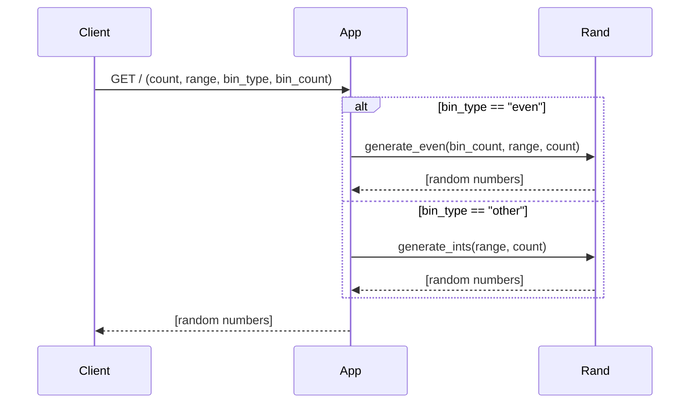

This microservice provides randomly generated numbers via GET requests to "http://127.0.0.1:5000/".
The generation can be modified according to specifications that are included in the query parameters.
Once the numbers are generated, they're sent back as a list in the http response (JSON).

Query parameters:
> count: number of numbers to generate  
> range: minimum and maximum of the generated numbers. Must be integers in the format "min,max"  
> bin_type: determines the type of binning.  
>> "even" (default): divides the range into the specified number of bins. The generated numbers will be rounded down to the nearest bin  
>> "int": all generated numbers will be an integer within the given range. bin_count is ignored  
>
> bin_count: the number of bins to be used with "even" bin_type. Leave empty or at 0 for no binning  

Response parameters:
> (all query parameters are included in the response)
> random_numbers: list of the generated numbers

To receive the generated numbers, access the "random_numbers" key within the JSON response

Example request and response (using python with the "requests" and json libraries):
```
# Prints a list of 20 numbers between [0, 10) with an increment of .5
def test_even():
    params = {
        "count": 20,
        "range": "0, 10",
        "bin_count": 10
    }
    r = requests.get("http://127.0.0.1:5000/", params=params)
    json_response = r.json()
    print(json_response["random_numbers"])
```
UML Sequence Diagram:
